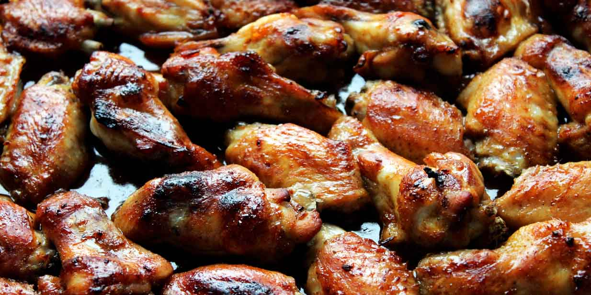

# Chicken Wings

## Zutaten (für 3-4 Personen)

- 1 kg Chicken Wings
- 2 EL Aprikosen Marmelade
- 2 EL Sojasauce
- 2 EL Essig
- 1 EL Honig
- 1 EL Barbecue-Sauce (gerne auch rauchig)
- 1 TL Sesam-Öl
- 1 Knoblauchzehe
- Salz, Pfeffer, Paprikapulver

## Zubereitung

Zunächst die Chicken Wings säubern und anschließend trocken tupfen. Die Chicken Wings in eine ausreichend große Auflaufform geben. Aus hygienischen Gründen anschließend die Hände und die Arbeitsplatte gründlich reinigen.

In einer anderen Schüssel die Marinade zubereiten. Dafür alle Zutaten für das Chicken Wings Rezept miteinander vermischen, den Knoblauch hineinpressen und mit etwas Salz, mehr Pfeffer sowie dem Paprikapulver würzen.

Nun die Marinade über die Chicken Wings geben und alles gut vermischen. So, dass alle Hähnchenteile gut mit der Marinade überzogen sind. Für mindestens eine halbe Stunde marinieren.

