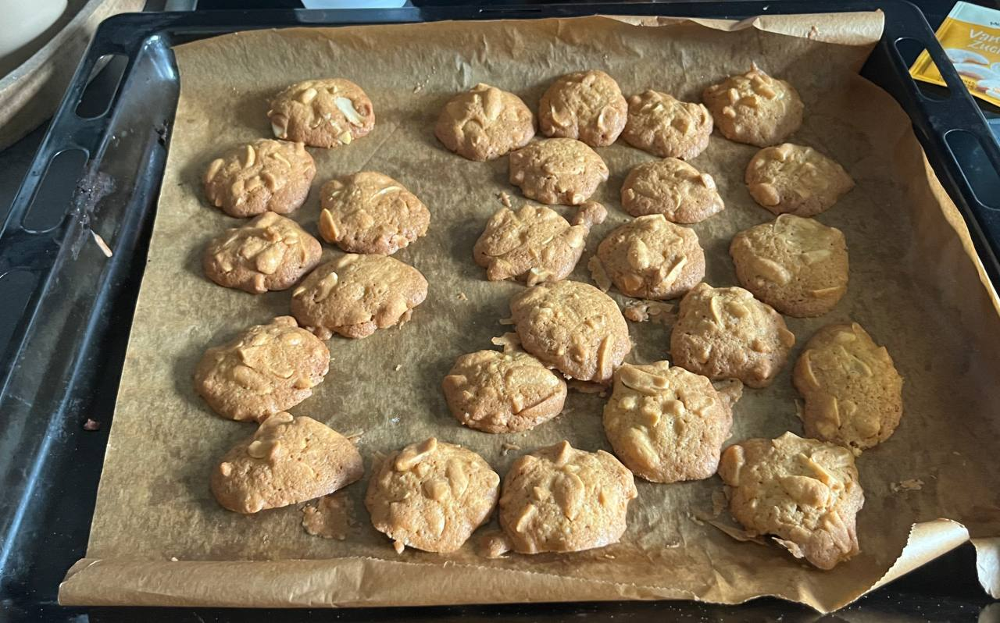

# Erdnuss Kekse

## Zutaten (50 Kekse)

- 75 g weiche Butter
- 100 g brauner Zucker
- 1 TL Vanillezucker
- 5 Tropfen Butter-Vanille-Aroma
- 120 g Mehl
- 1 Teelöffel Backpulver (gestrichen)
- 1 Ei
- 200 g gesalzene Erdnüsse

## Zubereitung

- Alle Zutaten bis auf Erdnüsse glatt verrühren
- Anschließend Erdnüsse hinzufügen und verrühren
- Backblech mit Backpapier auf 160 °C Umluft vorheizen
- Kekse (ca. 25 pro Blech) mit 2 Teelöffeln platzieren
- Für 20 Minuten backen
  

