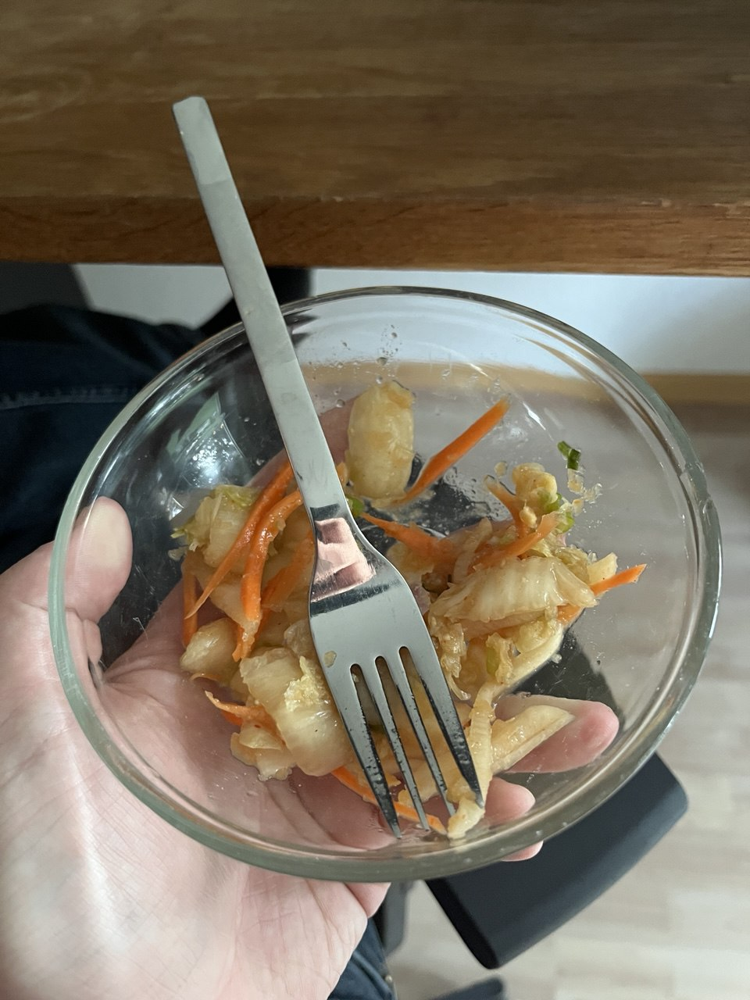

# Kimchi

- 1kg Chinakohl
- 25g Salz
- 150g Rettich
- 2 Möhren
- 2 Frühlingszwiebeln
- 1 Zwiebel
- 6 Knoblauchzehen
- 1 Stück Ingwer
- 1 Nashi Birne
- Chilipulver
- Paprikapulver
- Sojasauce
- 100ml Gemüsebrühe
- 2 EL Reismehl
- 2 TL Rohrzucker

## 1. Chinakohl kleinschneiden

> 1kg Chinakohl  
25g Salz

- Kohl in Streifen schneiden
- Salzen
- Stehen lassen

## 2. Marinade kochen

> 100ml Brühe  
2 TL Reismehl
2 EL Rohrzucker

- Alles kochen bis Brei entsteht
- Abkühlen lassen

## 3. Marinade fertig machen

> 1 Zwiebel  
6 Knoblauch  
1 Nashi Birne  
1 Stück Ingwer  
5 EL Sojasauce
2 EL Paprika Pulver
Chilipulver

- Alles zusammen mixen

## 4. Kohl ausdrücken

- Kohl abgießen und auffangen
- Kohl waschen und ausdrücken

## 5. Alles zusammen

> 150g Rettich  
2 Möhren

- Gemüse schälen und raspeln, direkt zu dem Kohl
- Marinade dazu
- In Gläsern ca 2-3 Tage draußen stehen lassen, dann Kühlschrank

