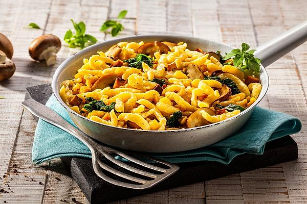

# Zutaten (4 Personen)

- 300 g	Baby-Blattspinat
- 250 g	Champignons
- 200 g	Räuchertofu
- 1 EL	Pflanzenöl
- 3 EL	Röstzwiebeln
- 80 ml	Brühe
- 200 ml	Sahne
- 1 Pck.	Henglein frische Eierspätzle
- Salz und Pfeffer, frisch gemahlen
- 50 g	Mozzarella, gerieben

