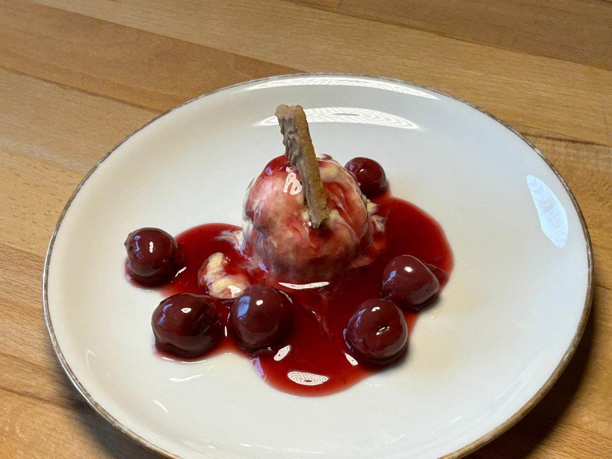

# Spekulatius Parfait

## Zutaten (8 Portionen)

### Parfait

- 150g Spekulatius
- 4 Eigelb
- 140g Zucker
- 1 Packung Vanillezucker
- 100ml Apfelsaft
- 400g Sahne

### Glühweinkirschen

- 300g Sauerkirschen
- 100ml Rotwein
- 1 Zimtstange
- 1EL Speisestärke

## Zubereitung

- Kastenform mit mind. 1,5 Liter Fassungsvermögen in Kühlschrank.
- Eigelb mit Zucker, Vanillezucker und Apfelsaft in einer Edelstahlschüssel vermischen.
- Anschließend in einem heißen Wasserbad (nicht kochend) schlagen, bis diese zu einer weißen, dicklichen Masse wird. Anschließend im kalten Wasserbad kalt schlagen.
- Spekulatius zerbröseln und vorsichtig unterrühren. Sahne steif schlagen und unterheben. Die Masse in die vorbereitete Form geben und die Form über Nacht in den Gefrierschrank stellen.
- Am nächsten Tag 100ml Wein und 100ml Saft von den Kirschen zusammen mit der Zimtstange aufkochen.
- Stärke einrühren und Kirschen für 5 Minuten mitkochen
- Parfait zusammen mit Kirschen servieren.

